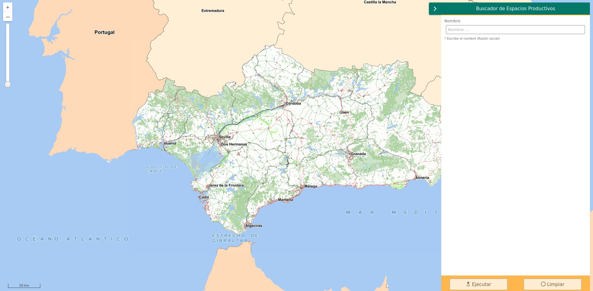

# Searchpanel

[](https://github.com/sigcorporativo-ja/Mapea4-dev-webpack)

## Descripción

 Plugin de [Mapea](https://github.com/sigcorporativo-ja/Mapea4) para la generación automática de paneles de búsquedas para realizar consultas a diferentes cores de geosearch. 



Para el correcto funcionamiento del plugin es necesario pasarle en su constructor un objeto **json** con los parámetros esperados.
### Parámetros del plugin

```javascript
{
  title: 'Buscador de Espacios Productivos',
  geosearchUrl: 'https://www.juntadeandalucia.es/institutodeestadisticaycartografia/geobusquedas/eepp-f1/search?',
  maxResults: 100,
  fields: [
    {
      field: 'municipio',
      alias: 'Municipio',
      label: 'Escribe el nombre del Municipio',
    },
    {
      field: 'provincia',
      alias: 'Provincia',
      label: 'Escribe el nombre de la Provincia',
    },
    {
      field: 'nombre',
      alias: 'Nombre',
      label: 'Escribe el nombre del Espacio Productivo',
    }
  ],
  infoFields: [
    {
      field: 'nombre',
      alias: 'Nombre '
    },
    {
      field: 'tipologia',
      alias: 'Tipología'
    },
    {
      field: 'municipio',
      alias: 'Municipio'
    },
    {
      field: 'provincia',
      alias: 'Provincia'
    }
  ]
}
```


- **title [string]:** Título del panel. El título aparecerá tanto al dejar el ratón encima del boton del plugin a modo de Tooltip como en la parte superior del panel.
- **geosearchUrl [string]:** url del core de geosearch al cual se desea consultar. La url deberá acabar con el símbolo **?**
- **maxResults [integer]:**  Número máximo de registros que se desea recibir. Esto permite  el número de resultados devueltos facilitando la paginación y los tiempos de respuesta del geosearch
- **fields: [array]** Campos sobre los que se desea buscar.(Array). Listado de campos que se desea que aparezcan en el Panel de buscador para realizar los filtros. Es necesario incluir los siguientes parámetros:

   - ***field:*** Nombre del campo en el core de geosearh
   - ***alias:*** Texto descriptivo del campo
   - ***label:*** Texto a mostar a modo de ayuda 


- **infoFields: [array]** Campos que se desean mostrar una vez optenidos los resultados. El orden de definición de estos afecta al orden de aparición en la tabla resultante.


   - ***field:*** Nombre del campo en el core de geosearh
   - ***alias:*** Texto descriptivo del campo


## Recursos y configuración

- js: searchpanel.ol.min.js
- css: searchpanel.min.css

```javascript

const configSearchPanel = {
  title: 'Buscador de Espacios Productivos',
  geosearchUrl: 'https://www.juntadeandalucia.es/institutodeestadisticaycartografia/geobusquedas/eepp-f1/search?',
  maxResults: 100,
  fields: [
    {
      field: 'municipio',
      alias: 'Municipio',
      label: 'Escribe el nombre del Municipio',
    },
    {
      field: 'provincia',
      alias: 'Provincia',
      label: 'Escribe el nombre de la Provincia',
    },
    {
      field: 'nombre',
      alias: 'Nombre',
      label: 'Escribe el nombre del Espacio Productivo',
    }
  ],
  infoFields: [
    {
      field: 'nombre',
      alias: 'Nombre '
    },
    {
      field: 'tipologia',
      alias: 'Tipología'
    },
    {
      field: 'municipio',
      alias: 'Municipio'
    },
    {
      field: 'provincia',
      alias: 'Provincia'
    }
  ]
};

const mp = new M.plugin.Searchpanel(configSearchPanel);
map.addPlugin(mp);
```

## Video Demo

Para comprobar el funcionamiento de este plugin se puede descargar el [Video](https://github.com/emiliopardo/searchpanel/blob/master/docs/video/searchpanel.webm?raw=true) el cual contempla la configuración y carga del plugin con diferentes geosearch